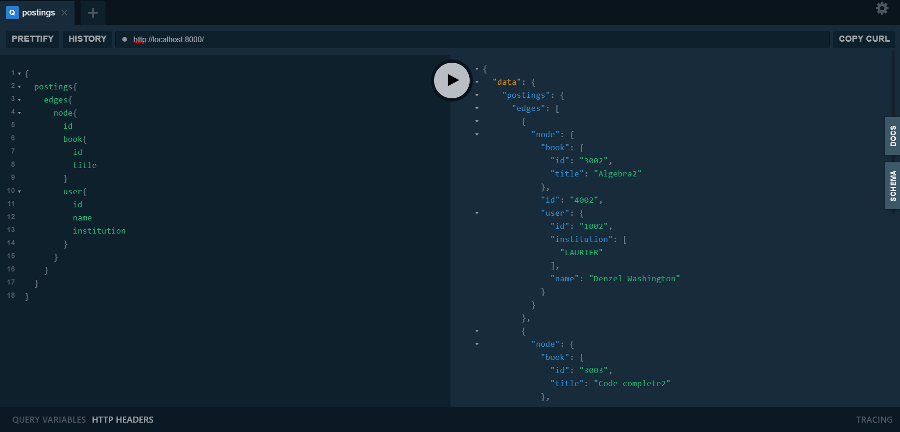

## How to use

- Go to the root directory
- Run command (It take about 5 min to install packages and size is 2.32 GB)
> cargo run

- Open a browser and enter following address
> localhost:8000

## play with graphql
### copy following queries and paste on GraphiQL

```graphql
{
	students{
    edges{
      node{
        id
        name
        institution
      }
    }
  }
}
```

```graphql
{
	student(id:"1001"){
		name
        institution
    }
}
```

```graphql
{
	postings{
    edges{
      node{
        id
        book{
          id
          title
        }
        user{
          id
          name
          institution
        }
      }
    }
  }
}
```

